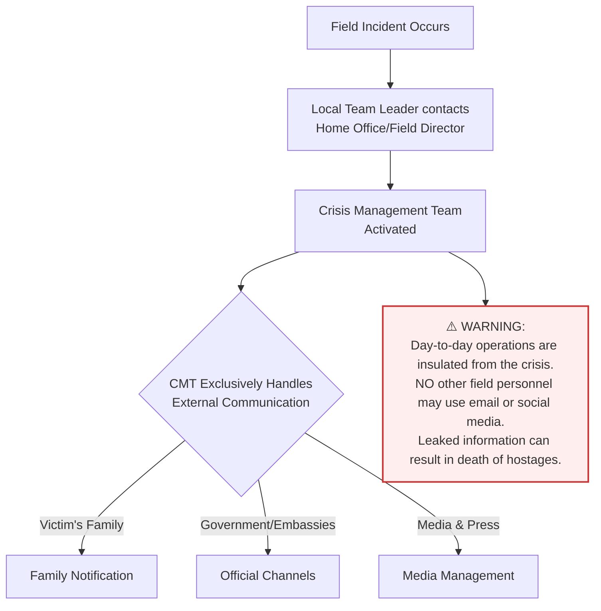

# Lesson 04: Corporate Evacuation and Continuity Planning

## Key Idea

How organizations preserve data, assets, and decision-making during crisis.

## Lesson Goal

Learn how this principle supports faithful fieldwork, local ownership, and long-term effectiveness.

## What This Lesson Teaches

- How organizations preserve data, assets, and decision-making during crisis.
- Why a shallow or foreign method can undermine local multiplication.
- How to choose one practical habit to apply immediately.

## Crisis Management Team (CMT) Communication Flow

## Practical Action

Identify one current approach in your context that should be changed to support sustainable local work.

## Lesson Summary

Use this lesson to shape a more sustainable, obedient, and locally led approach.

## Further reading/resources
- *Serving with Eyes Wide Open* by David Livermore
- *100 Deadly Skills* by Clint Emerson
- *The Gift of Fear* by Gavin de Becker
- *Left of Bang* by Patrick Van Horne and Jason Riley
- *What Every BODY Is Saying* by Joe Navarro
- *Extreme Ownership* by Jocko Willink
- *Survival & Austere Medicine* (Austere Medical manual)

  <a class="mri-button secondary" href="lesson-03.md">Back</a>
  <a class="mri-button primary" href="lesson-05.md">Next Lesson</a>

