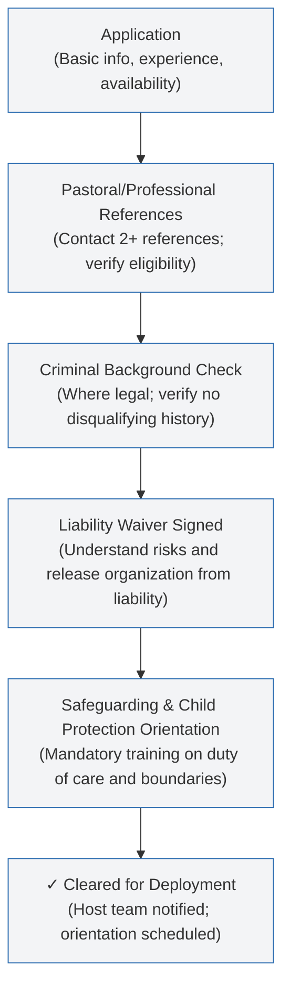

# Lesson 04: Short-Term Volunteer Screening and Liability

## Lesson overview

Short-term workers create long-term risk if they are not screened, trained, supervised, and bound by safeguarding standards.

## Key idea

Short-term volunteers require the same ethical screening and legal protections as career personnel.

## Why this matters

Unscreened volunteers can expose the organization to liability, harm local partners, and undermine ministry credibility.

## Field context

This applies to visitors, teams, and short-term helpers entering sensitive ministry environments.

## Leader role

Leaders should require applications, references, background screening, and liability waivers.

## Team role

Host teams should orient, supervise, and monitor short-term volunteers carefully.

## Preparation

- Create a volunteer application form.
- Draft a liability waiver and safeguarding agreement.
- Define training and supervision expectations.

## Step 1: Screen applicants

Collect pastoral references, relevant experience, and any required background checks.

## Short-Term Volunteer Screening Flow

## Step 2: Obtain liability waivers

Use a waiver that is appropriate for your legal jurisdiction and describes expected risks.

## Step 3: Train and supervise

Provide orientation, clear expectations, and active supervision for short-term workers.

## Common challenges

Organizations sometimes assume volunteers are low risk. In reality, they often increase operational risk.

## Practical example

A ministry requires every short-term team member to submit an application and sign a liability waiver before arrival.

## Reflection questions

1. What screening steps are missing from your current process?
2. Who reviews volunteer applications?
3. How will you supervise short-term workers in the field?

## Summary

Volunteer screening, training, and liability controls are essential to protect the organization and local communities.

## Next step

Use the Short-Term Volunteer Application & Liability Waiver template for your next visitor.

> **Risk / Disclaimer:** This lesson is for general training only and is not legal advice. Consult a qualified attorney for volunteer screening and liability issues.

  <a class="mri-button secondary" href="lesson-03.md">Back</a>
  <a class="mri-button primary" href="lesson-05.md">Next Lesson</a>

