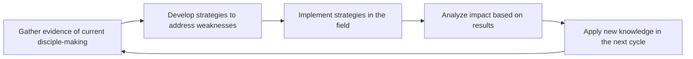

# Lesson 5: Disciple-Making Learning Communities (DMLC)

## Course/series
Orality & Movement-Based Discipleship

## Audience
- Field teams committed to sustained movement building
- Trainers leading action-oriented learning groups
- Leaders needing accountability systems for disciple-making

## Purpose
Teach learners how to form and sustain Disciple-Making Learning Communities that prioritize practice over theory, experimentation over isolation, and results over good intentions.

## Learning objectives
- Describe the DMLC 3:1 practice-to-theory ratio
- Identify key roles and rhythms for a DMLC
- Create a 90-day action plan for field learning and accountability

## Core principle
Sustainable movements grow when teams learn together in the field with more practice than theory.

## Field problem
Isolated workers often plan without testing, learn without accountability, and fail to reproduce because they lack a community of practice.

## Key concepts
- Practice before theory (3 parts practice, 1 part theory)
- Continuous experimentation and rapid feedback
- Accountability based on tangible fruit

## Practical framework
Use the DMLC 90-Day Action Plan to set SMART goals, practice cycles, review meetings, and accountability markers.

::: admonition note
DMLC ratio: 3 parts practice to 1 part theory. Emphasize action, experimentation, and repetition over lengthy planning.
:::

## Scenario or case exercise
A small team meets weekly to report on one new story they used, one insight from the field, and one adaptation for the next week.

## Checklist or worksheet
- How often does the group practice stories or gospel conversations?
- What measurable fruit is the group tracking?
- How is learning shared among team members?

## Discussion questions
1. What will your first DMLC experiment focus on?
2. How will you keep practice central to your learning?
3. What accountability markers matter most in your setting?

## Field assignment
Form or join a DMLC and draft a 90-day cycle with practice sessions, reflection meetings, and field experiments.

## Further reading/resources
- *Making Disciples of Oral Learners* by the International Orality Network
- *Truth That Sticks* by Avery Willis and Mark Snowden
- *The Art of Storytelling* by John Walsh
- *Christian Storytelling* by Eric B. Hare and Arthur Spalding
- *Orality and Literacy* by Walter J. Ong
- *Is Hearing Enough? Literacy and the Great Commandments* by Donald E. Chapman
- DMLC coaching guides
- Field reports from movement-based teams

## Reviewer notes
Confirm the action plan is realistic for the team’s context and includes both practice and accountability.

## Risk/disclaimer notes
This material is for educational purposes and is not legal, medical, tax, accounting, counseling, or security advice. Consult qualified professionals before adopting policies or making high-risk decisions.
