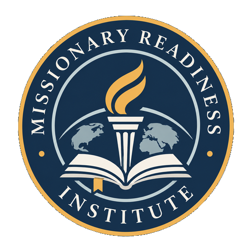
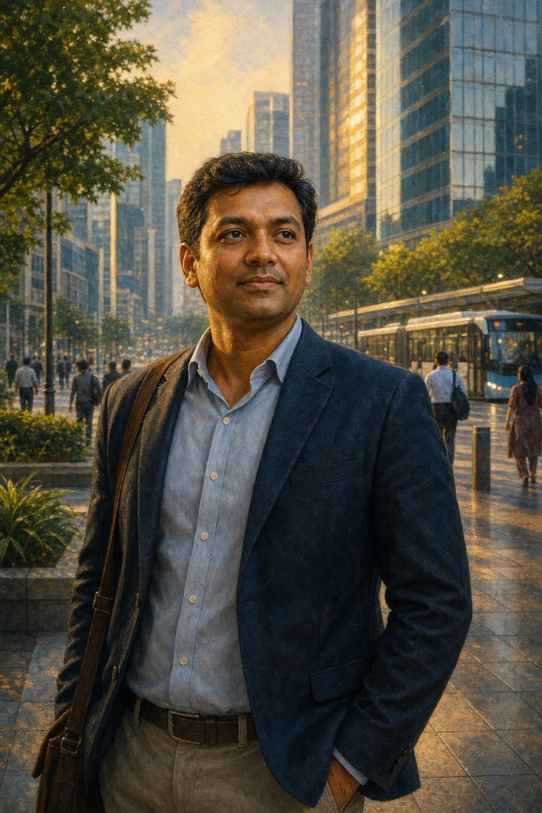
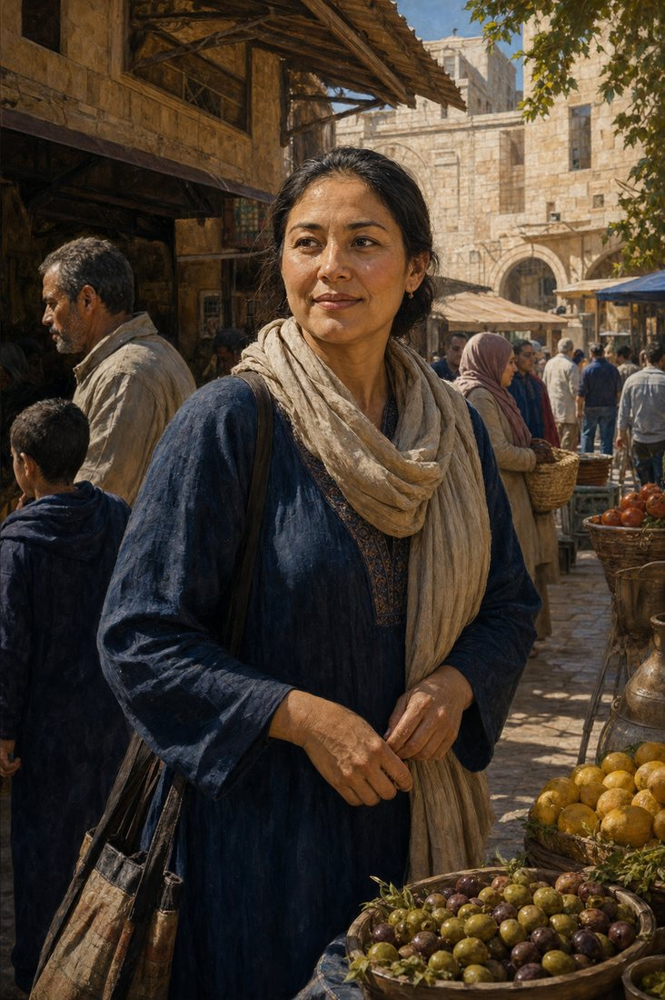

<section class="mri-hero">
  

    
Emerging training platform

    <h1>Missionary Readiness Institute</h1>
    
Practical training for faithful cross-cultural service.

    

      <a class="mri-button primary" href="courses/">Explore courses</a>
      <a class="mri-button secondary" href="about/">About the platform</a>
    

  

  

    
  

</section>

## What This Platform Is

This is a static, early-stage training site built to support better readiness conversations. It is not an accredited school, seminary, mission board, sending agency, full LMS, or finished certification ecosystem.

The goal is simple: provide clear course materials that help learners prepare with biblical faithfulness, cross-cultural humility, accountability, safety, and practical care.

## Start Here

  <section class="mri-card">
    <h3><a href="courses/missionary-readiness-101/">Missionary Readiness 101</a></h3>
    

      Beginner
      45-60 min
      Available draft
    

    
Begin with the core readiness framework for learners, churches, sponsors, and families.

  </section>
  <section class="mri-card">
    <h3><a href="courses/">Course Catalog</a></h3>
    

      Foundational
      In development
    

    
Browse the first readiness tracks in formation, culture, care, language learning, and field entry.

  </section>
  <section class="mri-card">
    <h3><a href="sponsor-brief/">Sponsor Brief</a></h3>
    

      For leaders
      One-page brief
    

    
Share the project problem, proposed solution, next steps, and ways supporters can help.

  </section>

## Who It Serves

  <section class="mri-card">
    <h3>Missionaries and families</h3>
    
Introductory preparation for people discerning or preparing for cross-cultural service.

  </section>
  <section class="mri-card">
    <h3>Churches and mentors</h3>
    
A shared framework for asking better readiness questions before sending or supporting workers.

  </section>
  <section class="mri-card">
    <h3>Sponsors and partners</h3>
    
Practical language for responsible support, care, communication, and accountability.

  </section>

## Training Approach

  
<strong>Readiness before activity.</strong> Readiness begins with Scripture, prayer, character, worship, and obedience.

  
<strong>Humility before strategy.</strong> Cross-cultural service should honor local churches, local leaders, and local communities.

  
<strong>Care before crisis.</strong> Preparation includes family safety, child protection, support systems, and appropriate boundaries.

  
<strong>Practical next steps.</strong> Courses include lessons, reflection questions, knowledge checks, and assignments for discussion.

## Learning For Varied Contexts

Missionary readiness should prepare people to listen and serve across rural and urban settings, among communities marked by simplicity, tradition, modern growth, and material prosperity. Training should help learners avoid assumptions and enter each place with humility.

  <figure class="mri-figure">
    
    <figcaption>Rural preparation: listening, patience, and respect for local rhythms.</figcaption>
  </figure>
  <figure class="mri-figure">
    
    <figcaption>Urban preparation: responsibility, complexity, and everyday professional life.</figcaption>
  </figure>
  <figure class="mri-figure">
    
    <figcaption>Community preparation: dignity, local relationships, and ordinary service.</figcaption>
  </figure>

Images are illustrative editorial artwork used to support reflective reading. They do not depict platform participants, partner organizations, or sending endorsements.

## Connect

For public updates and general communication, follow [Missionary Readiness Institute on Facebook](https://www.facebook.com/MissionaryReadinessInstitute).

Questions, corrections, partnership conversations, and course feedback may also be sent to [robert@tetra6.com](mailto:robert@tetra6.com).

!!! note "Current status"
    This public site is an emerging readiness platform. Course materials are introductory and should be reviewed by responsible ministry leaders before use in formal training.
